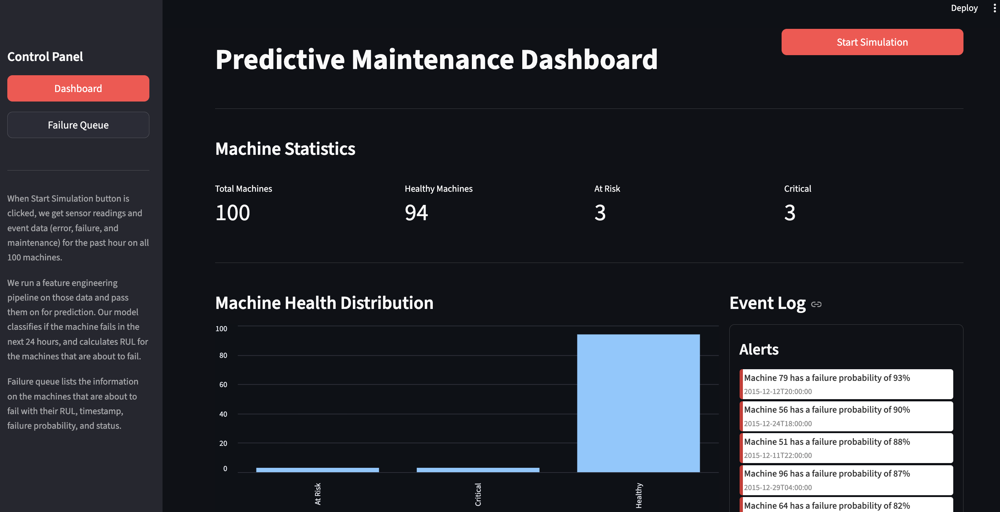
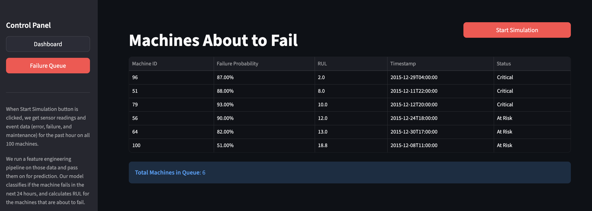
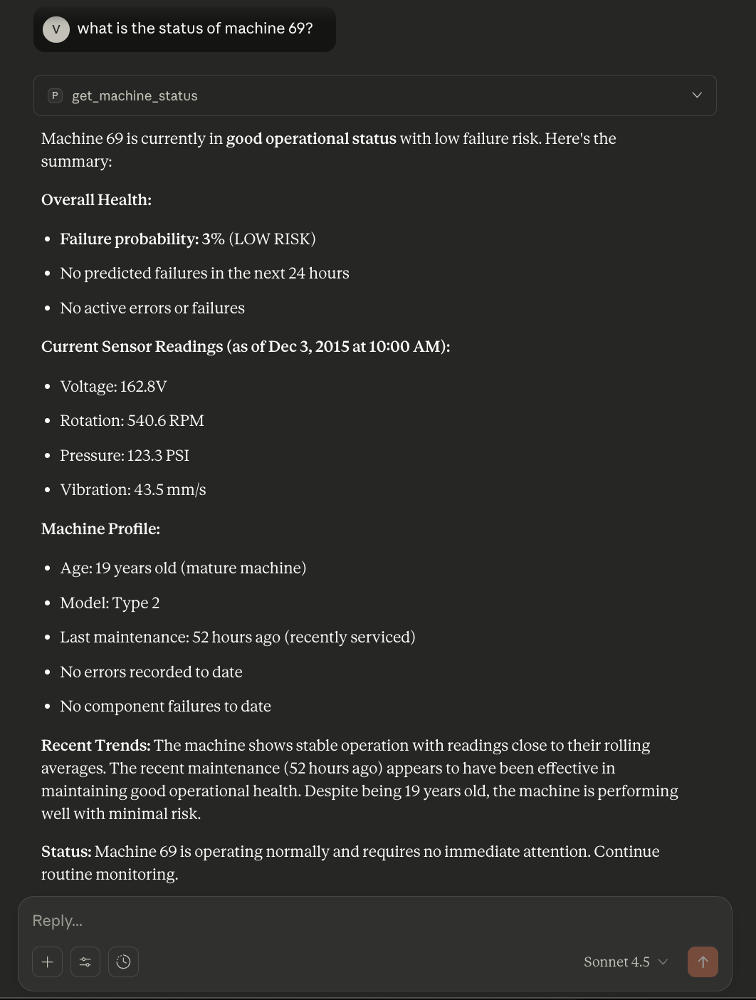

# Predictive Maintenance Analysis System with MCP Integration

A scalable, end-to-end predictive maintenance framework designed to simulate real-world industrial machine monitoring.

## About

This project implements a predictive maintenance analysis system using Microsoft Azure's maintenance dataset. It includes notebooks for data preparation, feature engineering, and training two Random Forest models: a classifier for 24-hour failure prediction and a regressor for Remaining Useful Life (RUL) estimation.

The models are then used to power a production-style simulation monitoring 100 machines with hourly sensor updates. Results are visualized through a Streamlit dashboard, while an MCP server is also exposed to enable LLMs to query the machine states so users can receive natural-language diagnostics— creating a complete pipeline from raw data handling to LLM-assisted interpretation, demonstrating how this framework can be used in an actual industrial environment.


## System Architecture

```
Raw hourly machine data
        │
        ▼
Feature Engineering Pipeline
(rolling stats, lags, event history,
machine-specific features)
        │
        ▼
Classification Model
Predict: Failure in next 24 hours?
        │
   No ──┴── Yes
           │
           ▼
     Regression Model
     Predict RUL (hours)
           │
           ▼
  User Dashboard (+  MCP server exposure for LLMs)

```

## Key Features

**1) Predictive Maintenance Pipeline**
- Hourly processing of 100 machines
- Feature engineering for extracting information
- Classification model predicts failure within next 24 hours
- Regression model predicts remaining useful life (RUL)

**2) Interactive Simulation Dashboard**
- At-risk queue for critical machines
- Real-time scoring for all machine health
- Hourly simulation demo piepline

**3) MCP Server Integration**
- Exposes machine state via MCP tools
- LLMs can request:
    - Machine health summary
    - Sensor snapshot interpretation
    - Predicted RUL
    - Alerts & work orders
- Enables natural-language industrial diagnostics

## Tech Stack
- **ML:** Random Forest models, pandas, numpy, scikit-learn
- **Backend and UI:** FastAPI, Python, Streamlit

## UI 

<div align="center">
  
   
   
</div>

## Contributors

<table>
  <tr>
    <td align="center">
      <a href="https://github.com/junggeyy">
        <br/>
        <sub><b>Vickey Ghimire</b></sub>
      </a>
    </td>
    <td align="center">
      <a href="https://github.com/ishanepal">
        <br/>
        <sub><b>Isha Nepal</b></sub>
      </a>
    </td>
    <td align="center">
      <a href="https://github.com/smaranbh7">
        <br/>
        <sub><b>Smaran Bhattarai</b></sub>
      </a>
    </td>
  </tr>
</table>

## Credits
The dataset for this project was obtained from kaggle @ https://www.kaggle.com/datasets/arnabbiswas1/microsoft-azure-predictive-maintenance
